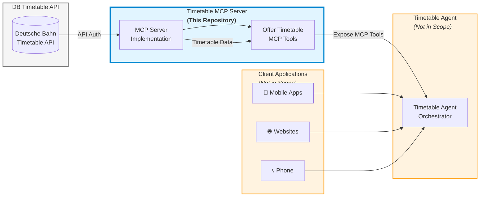

# DB-TimetableAPI-MCPServer

> **Model Context Protocol (MCP) Server for Deutsche Bahn Timetable API Integration**

An MCP Server that bridges AI agents with the Deutsche Bahn Timetable API, enabling seamless access to German railway schedule data, real-time updates, and station information through a standardized protocol.

---

## 📋 Table of Contents

- [Overview](#overview)
- [What is Model Context Protocol (MCP)?](#what-is-model-context-protocol-mcp)
- [Architecture](#architecture)
- [Features](#features)
- [Prerequisites](#prerequisites)
- [Installation](#installation)
- [Configuration](#configuration)
- [Usage](#usage)
- [MCP Tools & Functions](#mcp-tools--functions)
- [Contributing](#contributing)
- [License](#license)
- [Resources](#resources)

---

## 🎯 Overview

The **DB-TimetableAPI-MCPServer** is an open-source implementation of a Model Context Protocol (MCP) server that integrates with the [Deutsche Bahn Timetable API](https://developers.deutschebahn.com/db-api-marketplace/apis/product/timetables). This project serves as middleware that fetches, processes, and serves German railway timetable data to downstream AI agents and client applications.

### Project Scope

This repository focuses **exclusively** on the MCP Server implementation. It does not include:
- Timetable agents or client applications
- User-facing interfaces (mobile apps, websites)
- Backend services beyond the MCP server itself

The MCP server acts as a standardized bridge, allowing AI agents to interact with Deutsche Bahn's timetable data through a unified protocol.

---

## 🤖 What is Model Context Protocol (MCP)?

The **Model Context Protocol (MCP)** is an open standard developed by Anthropic that simplifies how AI agents connect to external systems, tools, and data sources. Think of it as "USB-C for AI" - a universal connector that eliminates the need for custom integrations.

### Key Concepts

- **MCP Host**: The environment where the AI agent lives (e.g., chatbot interface, IDE)
- **MCP Client**: A bridge that converts user requests into MCP-compliant messages
- **MCP Server**: The backend service (like this project) that performs operations and fetches data

### Why MCP?

- **Standardization**: One protocol to connect AI agents with any data source
- **Modularity**: Reusable server components that work across different AI applications
- **Real-time Context**: Enables AI agents to access live data beyond their training set
- **Scalability**: Reduces integration complexity as your AI ecosystem grows

For more information, visit the [official MCP documentation](https://modelcontextprotocol.io/).

---

## 🏗️ Architecture

The following diagram illustrates how the DB-TimetableAPI-MCPServer fits into the overall solution:

### Component Flow

1. **DB Timetable API**
   - Deutsche Bahn's official timetable API
   - Requires API authentication
   - Provides schedule and real-time train data

2. **Timetable MCP Server** - **This Repository**
   - Authenticates with DB API
   - Fetches and processes timetable data
   - Exposes standardized MCP tools for agents
   - Implements the Model Context Protocol specification

3. **Timetable Agent** (Not in Scope)
   - Consumes MCP tools from this server
   - Orchestrates requests and responses
   - Interfaces with client applications

4. **Client Applications** (Not in Scope)
   - Mobile apps, websites, voice assistants, etc.
   - End-user interfaces for timetable information

**This repository implements only the MCP Server component.**

---

## ✨ Features

The DB-TimetableAPI-MCPServer is planning to provide the following capabilities:

### Core Functionality

- 🔜 **Planned Timetable Access**: Retrieve scheduled arrivals and departures for any DB station
- 🔜 **Real-Time Updates**: Access live delay information, cancellations, and platform changes
- 🔜 **Station Search**: Find stations and retrieve detailed facility information
- 🔜 **Standardized MCP Interface**: Expose Deutsche Bahn data through MCP protocol

### Data Capabilities

- Train schedules (IC, ICE, RE, regional trains)
- Platform information
- Delay status and cancellation notices
- Route changes and service disruptions
- Station metadata and facilities
- Historical and real-time data access

---

## 📦 Prerequisites

Before setting up the MCP server, ensure you have the following:

### System Requirements

WIP

### DB API Access

You must obtain API credentials from Deutsche Bahn:

1. Visit the [DB API Marketplace](https://developers.deutschebahn.com/db-api-marketplace/apis/product/timetables)
2. Create a developer account
3. Subscribe to the **Timetable API**
4. Generate your API key
5. Review the API terms of service and usage limits

**Note**: The Timetable API uses a Creative Commons Attribution 4.0 (CC BY 4.0) license. Make sure your use case complies with these terms.

---

## 🚀 Installation

Work in progress. 

---

## ⚙️ Configuration

### Environment Variables

### Configuration Options

### API Rate Limits

Be aware of Deutsche Bahn API rate limits:
- Public endpoints: Up to 60 requests per second
- Authenticated endpoints: Varies by subscription tier

Configure appropriate caching and request throttling in your deployment.

---

## 🎮 Usage

### Starting the MCP Server

WIP

### Integrating with Agents

WIP

---

## 🔧 MCP Tools & Functions (Planned/Work in prgress)

The server exposes the following MCP tools for AI agents:

WIP

---

## 🤝 Contributing

We welcome contributions from the community!

Feel free to open an issue or provide a PR. 

---

## 📄 License

This project is licensed under the **MIT License** - see the [LICENSE](LICENSE) file for details.

### Third-Party Licenses

- **Deutsche Bahn Timetable API**: Licensed under Creative Commons Attribution 4.0 (CC BY 4.0)
- **Model Context Protocol**: Open standard by Anthropic

When using this software, ensure compliance with all applicable licenses and terms of service.

---

## 📚 Resources

### Official Documentation

- [Deutsche Bahn API Marketplace](https://developers.deutschebahn.com/db-api-marketplace/)
- [DB Timetable API Documentation](https://developers.deutschebahn.com/db-api-marketplace/apis/product/timetables)
- [Model Context Protocol Specification](https://modelcontextprotocol.io/)
- [MCP Getting Started Guide](https://modelcontextprotocol.io/docs/getting-started/intro)

### Related Projects

- [Anthropic MCP Documentation](https://www.anthropic.com/news/model-context-protocol)
- [MCP Server Examples](https://github.com/modelcontextprotocol/servers)

---

## 🙏 Acknowledgments

- **Deutsche Bahn** for providing the Timetable API
- **Anthropic** for developing the Model Context Protocol
