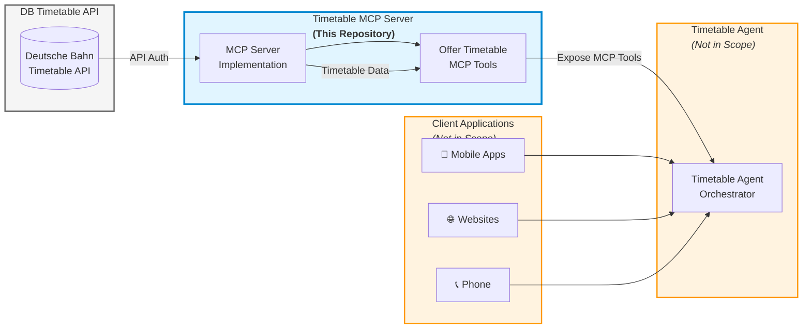

# DB-TimetableAPI-MCPServer

[](https://github.com/abeckDev/DB-TimetableAPI-MCPServer/actions/workflows/dotnet-ci.yml)
[](https://github.com/abeckDev/DB-TimetableAPI-MCPServer/actions/workflows/docker-publish.yml)
[](https://opensource.org/licenses/MIT)
[](https://codecov.io/github/abeckDev/DB-TimetableAPI-MCPServer)

> **Model Context Protocol (MCP) Server for Deutsche Bahn Timetable API Integration**

An MCP Server that bridges AI agents with the Deutsche Bahn Timetable API, enabling seamless access to German railway schedule data, real-time updates, and station information through a standardized protocol.

---

## 🎯 Overview

The **DB-TimetableAPI-MCPServer** is an open-source implementation of a Model Context Protocol (MCP) server that integrates with the [Deutsche Bahn Timetable API](https://developers.deutschebahn.com/db-api-marketplace/apis/product/timetables). This project serves as middleware that fetches, processes, and serves German railway timetable data to downstream AI agents and client applications.

### Project Scope

This repository focuses **exclusively** on the MCP Server implementation. It does not include:
- Timetable agents or client applications
- User-facing interfaces (mobile apps, websites)
- Backend services beyond the MCP server itself

The MCP server acts as a standardized bridge, allowing AI agents to interact with Deutsche Bahn's timetable data through a unified protocol.

---

## 🏗️ Architecture

The following diagram illustrates how the DB-TimetableAPI-MCPServer fits into the overall solution:



### Component Flow

1. **DB Timetable API**
   - Deutsche Bahn's official timetable API
   - Requires API authentication
   - Provides schedule and real-time train data

2. **Timetable MCP Server** - **This Repository**
   - Authenticates with DB API
   - Fetches and processes timetable data
   - Exposes standardized MCP tools for agents
   - Implements the Model Context Protocol specification

3. **Timetable Agent** (Not in Scope)
   - Consumes MCP tools from this server
   - Orchestrates requests and responses
   - Interfaces with client applications

4. **Client Applications** (Not in Scope)
   - Mobile apps, websites, voice assistants, etc.
   - End-user interfaces for timetable information

**This repository implements only the MCP Server component.**

---

## 🤖 What is Model Context Protocol (MCP)?

The **Model Context Protocol (MCP)** is an open standard developed by Anthropic that simplifies how AI agents connect to external systems, tools, and data sources. Think of it as "USB-C for AI" - a universal connector that eliminates the need for custom integrations.

### Key Concepts

- **MCP Host**: The environment where the AI agent lives (e.g., chatbot interface, IDE)
- **MCP Client**: A bridge that converts user requests into MCP-compliant messages
- **MCP Server**: The backend service (like this project) that performs operations and fetches data

### Why MCP?

- **Standardization**: One protocol to connect AI agents with any data source
- **Modularity**: Reusable server components that work across different AI applications
- **Real-time Context**: Enables AI agents to access live data beyond their training set
- **Scalability**: Reduces integration complexity as your AI ecosystem grows

For more information, visit the [official MCP documentation](https://modelcontextprotocol.io/).

---

## ✨ Features

The DB-TimetableAPI-MCPServer is planning to provide the following capabilities:

### Core Functionality

- ✅ **Planned Timetable Access**: Retrieve scheduled arrivals and departures for any DB station
- ✅ **Real-Time Updates**: Access live delay information, cancellations, and platform changes
- ✅ **Station Search**: Find stations and retrieve detailed facility information
- ✅ **Standardized MCP Interface**: Expose Deutsche Bahn data through MCP protocol

### Data Capabilities

- Train schedules (IC, ICE, RE, regional trains)
- Platform information
- Delay status and cancellation notices
- Route changes and service disruptions
- Station metadata and facilities
- Historical and real-time data access

---

## 📦 Prerequisites

Before setting up the MCP server, ensure you have the following:

### System Requirements

- **.NET 9.0 SDK** or later
  - Download from [dotnet.microsoft.com](https://dotnet.microsoft.com/download)
  - Verify installation: `dotnet --version`
- **Node.js** (LTS version recommended)
  - Required for MCP Inspector debugging tool
  - Download from [nodejs.org](https://nodejs.org/)
  - Verify installation: `node --version` and `npm --version`
- **Git** for version control
- **Visual Studio Code** (recommended for devcontainer support)
  - Install the [Dev Containers extension](https://marketplace.visualstudio.com/items?itemName=ms-vscode-remote.remote-containers) for devcontainer support

### DB API Access

You must obtain API credentials from Deutsche Bahn:

1. Visit the [DB API Marketplace](https://developers.deutschebahn.com/db-api-marketplace/apis/product/timetables)
2. Create a developer account
3. Subscribe to the **Timetable API**
4. Generate your API key
5. Review the API terms of service and usage limits

**Note**: The Timetable API uses a Creative Commons Attribution 4.0 (CC BY 4.0) license. Make sure your use case complies with these terms.

---

## 🚀 Installation

### Clone the Repository

```bash
git clone https://github.com/abeckDev/DB-TimetableAPI-MCPServer.git
cd DB-TimetableAPI-MCPServer
```

### Restore NuGet Packages

```bash
dotnet restore
```

### Build the Project

```bash
dotnet build
```

The project should build successfully. If you encounter any issues, ensure you have .NET 9.0 SDK installed. 

### Using Docker (Recommended for Production)

The easiest way to run the MCP server is using Docker. Pre-built images are automatically published to the GitHub Container Registry.

#### Pull and Run the Latest Image

```bash
# Pull the latest image from GitHub Container Registry
docker pull ghcr.io/abeckdev/db-timetableapi-mcpserver:latest

# Run the container with your API credentials
docker run -d \
  --name db-timetable-mcp \
  -p 3001:3001 \
  -e DeutscheBahnApi__ClientId="your-actual-client-id" \
  -e DeutscheBahnApi__ApiKey="your-actual-api-key" \
  -e DeutscheBahnApi__BaseUrl="https://apis.deutschebahn.com/db-api-marketplace/apis/timetables/v1/" \
  ghcr.io/abeckdev/db-timetableapi-mcpserver:latest

# Check if the container is running
docker ps

# View logs
docker logs db-timetable-mcp
```

The MCP server will be accessible at `http://localhost:3001/mcp`.

#### Build Your Own Docker Image

If you prefer to build the Docker image locally:

```bash
# Build the image
docker build -t db-timetableapi-mcpserver:local .

# Run the container
docker run -d \
  --name db-timetable-mcp \
  -p 3001:3001 \
  -e DeutscheBahnApi__ClientId="your-actual-client-id" \
  -e DeutscheBahnApi__ApiKey="your-actual-api-key" \
  -e DeutscheBahnApi__BaseUrl="https://apis.deutschebahn.com/db-api-marketplace/apis/timetables/v1/" \
  db-timetableapi-mcpserver:local
```

#### Docker Compose

You can also use Docker Compose for easier management. Create a `docker-compose.yml` file:

```yaml
services:
  mcp-server:
    image: ghcr.io/abeckdev/db-timetableapi-mcpserver:latest
    container_name: db-timetable-mcp
    ports:
      - "3001:3001"
    environment:
      - DeutscheBahnApi__ClientId=your-actual-client-id
      - DeutscheBahnApi__ApiKey=your-actual-api-key
      - DeutscheBahnApi__BaseUrl=https://apis.deutschebahn.com/db-api-marketplace/apis/timetables/v1/
    restart: unless-stopped
```

Then run:

```bash
docker compose up -d
```

#### Docker Image Tags

Images are tagged with multiple identifiers for flexibility:

- `latest` - The most recent build from the main branch
- `main` - Same as latest, tracks the main branch
- `main-<sha>` - Specific commit SHA from the main branch (e.g., `main-abc1234`)

Example pulling a specific version:

```bash
docker pull ghcr.io/abeckdev/db-timetableapi-mcpserver:main-a1b2c3d
```

---

## ⚙️ Configuration

### Setting up API Credentials

The MCP server requires Deutsche Bahn API credentials to function. You can configure these in two ways:

#### Option 1: Using appsettings.Development.json (Recommended for Local Development)

1. Navigate to the project directory:
   ```bash
   cd AbeckDev.DbTimetable.Mcp
   ```

2. Create or edit `appsettings.Development.json`:
   ```json
   {
     "Logging": {
       "LogLevel": {
         "Default": "Information",
         "Microsoft.AspNetCore": "Warning"
       }
     },
     "DeutscheBahnApi": {
       "BaseUrl": "https://apis.deutschebahn.com/db-api-marketplace/apis/timetables/v1/",
       "ClientId": "your-actual-client-id",
       "ApiKey": "your-actual-api-key"
     }
   }
   ```

   ⚠️ **Note**: The `appsettings.Development.json` file is already in `.gitignore` to prevent accidentally committing your credentials.

#### Option 2: Using Environment Variables

You can also configure the server using environment variables:

```bash
export DeutscheBahnApi__ClientId="your-actual-client-id"
export DeutscheBahnApi__ApiKey="your-actual-api-key"
export DeutscheBahnApi__BaseUrl="https://apis.deutschebahn.com/db-api-marketplace/apis/timetables/v1/"
```

For Windows PowerShell:
```powershell
$env:DeutscheBahnApi__ClientId="your-actual-client-id"
$env:DeutscheBahnApi__ApiKey="your-actual-api-key"
$env:DeutscheBahnApi__BaseUrl="https://apis.deutschebahn.com/db-api-marketplace/apis/timetables/v1/"
```

### Configuration Options

The following configuration options are available under the `DeutscheBahnApi` section:

| Option | Description | Required | Default |
|--------|-------------|----------|---------|
| `BaseUrl` | Base URL for the Deutsche Bahn Timetable API | Yes | `https://apis.deutschebahn.com/db-api-marketplace/apis/timetables/v1/` |
| `ClientId` | Your DB API Client ID from the marketplace | Yes | - |
| `ApiKey` | Your DB API Key from the marketplace | Yes | - |

### API Rate Limits

Be aware of Deutsche Bahn API rate limits:
- Public endpoints: Up to 60 requests per second
- Authenticated endpoints: Varies by subscription tier

Configure appropriate caching and request throttling in your deployment.

---

## 🎮 Usage

### Starting the MCP Server

#### Running Locally (Command Line)

1. Navigate to the project directory:
   ```bash
   cd AbeckDev.DbTimetable.Mcp
   ```

2. Run the server:
   ```bash
   dotnet run
   ```

3. The server will start and listen on `http://0.0.0.0:3001`
   - The MCP endpoint is available at: `http://localhost:3001/mcp`

4. You should see output similar to:
   ```
   info: Microsoft.Hosting.Lifetime[14]
         Now listening on: http://0.0.0.0:3001
   info: Microsoft.Hosting.Lifetime[0]
         Application started. Press Ctrl+C to shut down.
   ```

#### Using VS Code Tasks

The project includes pre-configured VS Code tasks for easier development:

1. Open the project in VS Code
2. Press `Ctrl+Shift+B` (or `Cmd+Shift+B` on macOS) to run the default build task
3. Use `Terminal > Run Task...` to access other tasks:
   - `build-solution`: Build the entire solution
   - `run-mcp-server`: Run the MCP server
   - `build-and-run-server`: Build and run the server in sequence

### Debugging the MCP Server

The MCP server can be debugged using the **MCP Inspector**, a visual debugging tool for Model Context Protocol servers.

#### Debugging with VS Code (Recommended)

The repository includes a pre-configured debug launch configuration:

1. **Install MCP Inspector** (if not already installed):
   ```bash
   npm install -g @modelcontextprotocol/inspector
   ```

2. **Configure your API credentials** in `appsettings.Development.json` as described in the Configuration section

3. **Open the project in VS Code**

4. **Start debugging**:
   - Press `F5` or go to `Run > Start Debugging`
   - Select "Debug MCP Server with Inspector (HTTP)" configuration
   - This will:
     - Build the solution
     - Start the MCP server on port 3001
     - Launch MCP Inspector on port 6274
     - Automatically open the Inspector UI in your browser

5. **Use the MCP Inspector**:
   - The Inspector provides a web-based interface to interact with your MCP server
   - Test the available tools (GetStationBoard, GetStationChanges, etc.)
   - View requests and responses in real-time
   - Debug issues with your MCP implementation

#### Manual Debugging Setup

If you prefer to run components separately:

1. **Start the MCP Server** in one terminal:
   ```bash
   cd AbeckDev.DbTimetable.Mcp
   dotnet run
   ```

2. **Start MCP Inspector** in another terminal:
   ```bash
   npx @modelcontextprotocol/inspector --transport http --server-url http://localhost:3001/mcp
   ```

3. **Open the Inspector** in your browser:
   - The Inspector will output a URL like: `http://localhost:6274`
   - Open this URL in your browser to access the debugging interface

### Testing the Server

Once the server is running, you can test it using the MCP Inspector:

1. **List Available Tools**:
   - In the MCP Inspector, click "List Tools" to see all available MCP tools
   - You should see: `get_station_board`, `get_recent_station_changes`, `get_full_station_changes`, `get_station_information`, `find_train_connections`

2. **Test get_station_information**:
   - Select the `get_station_information` tool
   - Enter a station name like "Frankfurt" or "Berlin"
   - Click "Call Tool" to execute
   - View the XML response with station information

3. **Test get_station_board**:
   - Select the `get_station_board` tool
   - Enter an EVA station number (e.g., `8000105` for Frankfurt Hauptbahnhof)
   - Optionally provide a date/time in format `yyyy-MM-dd HH:mm`
   - Click "Call Tool" to see arrivals and departures

### Integrating with AI Agents

To integrate this MCP server with AI agents or client applications:

1. **Connect to the MCP endpoint**: `http://localhost:3001/mcp`
2. **Use HTTP transport** as configured in this implementation
3. **Available Tools**:
   - `get_station_board`: Retrieve departures and arrivals for a station.
   - `get_recent_station_changes`: Get recent changes (delays, cancellations).
   - `get_full_station_changes`: Get all timetable changes for a station.
   - `get_station_information`: Search for station information.
   - `find_train_connections`: Find and assess train connections between two stations with delay information.

For production deployments, consider:
- Using HTTPS with proper SSL certificates
- Implementing rate limiting and caching
- Adding authentication/authorization
- Deploying behind a reverse proxy

---

## 🐳 Development with DevContainers

This project includes a complete DevContainer configuration for VS Code, providing a consistent development environment with all required tools pre-installed.

### What is a DevContainer?

DevContainers (Development Containers) allow you to use a Docker container as a full-featured development environment. This ensures:
- Consistent development environment across all team members
- No need to install .NET, Node.js, or other tools locally
- Isolated environment that doesn't affect your local system
- Pre-configured with all necessary extensions and tools

### Prerequisites for DevContainers

- **Docker Desktop** installed and running
  - [Windows/macOS](https://www.docker.com/products/docker-desktop)
  - [Linux](https://docs.docker.com/engine/install/)
- **Visual Studio Code** with the **Dev Containers extension**
  - Install from: [Dev Containers extension](https://marketplace.visualstudio.com/items?itemName=ms-vscode-remote.remote-containers)

### Opening the Project in a DevContainer

1. **Clone the repository** (if you haven't already):
   ```bash
   git clone https://github.com/abeckDev/DB-TimetableAPI-MCPServer.git
   cd DB-TimetableAPI-MCPServer
   ```

2. **Open in VS Code**:
   ```bash
   code .
   ```

3. **Reopen in Container**:
   - VS Code should detect the `.devcontainer` configuration
   - A notification will appear: "Folder contains a Dev Container configuration file"
   - Click **"Reopen in Container"**
   - Alternatively, press `F1` and select **"Dev Containers: Reopen in Container"**

4. **Wait for Container Build**:
   - The first time will take several minutes as it builds the container
   - The container includes:
     - .NET 9.0 SDK
     - Node.js LTS
     - Azure CLI
     - MCP Inspector (automatically installed)
     - All necessary VS Code extensions

5. **Start Developing**:
   - Once the container is ready, you can immediately start coding
   - All terminals in VS Code will run inside the container
   - The project is automatically restored and ready to build

### DevContainer Features

The DevContainer is configured with:

- **Base Image**: `mcr.microsoft.com/devcontainers/dotnet:1-9.0-bookworm`
- **Installed Tools**:
  - .NET 9.0 SDK
  - Node.js LTS
  - Azure CLI
  - MCP Inspector (via npm)
- **VS Code Extensions**:
  - C# Dev Kit
  - C# Extension
  - Azure CLI Extension
  - GitHub Copilot (if available)
  - GitHub Actions Extension
  - VS Code Icons
- **Port Forwarding**:
  - Port 3001: MCP Server
  - Port 6274: MCP Inspector
  - Port 6277: MCP Inspector Proxy

### Configuring API Credentials in DevContainer

After opening the project in a DevContainer:

1. Create `AbeckDev.DbTimetable.Mcp/appsettings.Development.json` with your credentials:
   ```json
   {
     "Logging": {
       "LogLevel": {
         "Default": "Information",
         "Microsoft.AspNetCore": "Warning"
       }
     },
     "DeutscheBahnApi": {
       "BaseUrl": "https://apis.deutschebahn.com/db-api-marketplace/apis/timetables/v1/",
       "ClientId": "your-actual-client-id",
       "ApiKey": "your-actual-api-key"
     }
   }
   ```

2. Start debugging with `F5` as described in the debugging section

### Benefits of Using DevContainers

✅ **Consistency**: Everyone on the team uses the exact same development environment
✅ **Quick Setup**: New contributors can start coding in minutes
✅ **Isolation**: Development environment doesn't interfere with your local system
✅ **Pre-configured**: All tools, extensions, and settings are ready to use
✅ **Reproducibility**: Environment can be version-controlled alongside the code

---

## 🔧 MCP Tools & Functions

The server exposes the following MCP tools for AI agents to interact with Deutsche Bahn's Timetable API:

### 1. GetStationBoard

**Description**: Get station board (departures and arrivals) for a specific station.

**Parameters**:
- `evaNo` (required): EVA station number (e.g., `8000105` for Frankfurt Hauptbahnhof)
- `dateTime` (optional): Date and time in format `yyyy-MM-dd HH:mm` (UTC). Leave empty for current time.

**Returns**: XML data with train schedules including:
- Train numbers and categories (ICE, IC, RE, etc.)
- Departure/arrival times
- Platforms
- Destinations/origins
- Train paths

**Example**:
```json
{
  "evaNo": "8000105",
  "dateTime": "2025-11-05 18:30"
}
```

### 2. GetRecentStationChanges

**Description**: Get all current changes (delays, cancellations, platform changes) for a specific station. Data includes only those changes that became known within the last 2 minutes.

**Parameters**:
- `evaNo` (required): EVA station number

**Returns**: XML data with recent changes including:
- Delays
- Cancellations
- Platform changes
- Other real-time updates

**Example**:
```json
{
  "evaNo": "8000105"
}
```

### 3. GetFullStationChanges

**Description**: Get full timetable changes for a specific train station. The data includes all known changes from now on until indefinitely into the future. Once changes become obsolete (because their trip departs from the station) they are removed.

**Parameters**:
- `eventNo` (required): Event number (EVA number) of the train event

**Returns**: XML data with comprehensive change history for the event

**Example**:
```json
{
  "eventNo": "1234567890"
}
```

### 4. GetStationInformation

**Description**: Get information about stations.

**Parameters**:
- `pattern` (required): Either a station name (prefix), EVA number, DS100/RL100 code, or wildcard (`*`). 
  - Note: Doesn't work well with umlauts in station names
  - Examples: `"Frankfurt"`, `"8000105"`, `"*"`

**Returns**: XML data with station information including:
- Station names
- EVA numbers
- Location coordinates
- Available facilities
- Station codes

**Example**:
```json
{
  "pattern": "Frankfurt"
}
```

### 5. FindTrainConnections

**Description**: Find and assess train connections between two stations. This comprehensive tool validates station names, finds all trains operating between the stations, checks for current delays and disruptions, and provides ranked connection options with recommendations.

**Parameters**:
- `stationA` (required): Starting station name or EVA number (e.g., `"Frankfurt Hbf"` or `"8000105"`)
- `stationB` (required): Destination station name or EVA number (e.g., `"Berlin Hbf"` or `"8011160"`)
- `dateTime` (optional): Date and time in format `yyyy-MM-dd HH:mm` (UTC). Leave empty for current time.

**Returns**: A comprehensive analysis report including:
- Validated station names with EVA numbers
- List of available train connections
- Departure times (scheduled and actual)
- Platform information
- Current delays and delay duration
- Cancellation status
- Service messages and disruptions
- Recommendation for best connection

**Example**:
```json
{
  "stationA": "Frankfurt Hbf",
  "stationB": "Berlin Hbf",
  "dateTime": "2025-11-06 14:30"
}
```

**Sample Output**:
```
=== Train Connection Analysis ===

Step 1: Resolving station 'Frankfurt Hbf'...
  ✓ Found: Frankfurt(Main)Hbf (EVA: 8000105)

Step 2: Resolving station 'Berlin Hbf'...
  ✓ Found: Berlin Hbf (EVA: 8011160)

Step 3: Fetching departures from Frankfurt(Main)Hbf...
  ✓ Timetable retrieved

Step 4: Checking for delays and disruptions at Frankfurt(Main)Hbf...
  ✓ Recent changes retrieved

Step 5: Finding trains from Frankfurt(Main)Hbf to Berlin Hbf...
  ✓ Found 3 connection(s)

=== Available Connections ===

Option 1: ICE 1234
  Departure: 14:30 from Frankfurt(Main)Hbf
  Platform: 7
  ✓ On time
  Destination: Berlin Hbf

Option 2: ICE 5678
  Departure: 15:30 from Frankfurt(Main)Hbf
  Platform: 9
  ⚠ Originally scheduled: 15:25
  ⚠ Delay: +5 minutes
  Destination: Berlin Hbf

=== Recommendation ===
✓ Best option: ICE 1234 at 14:30 - On time
```

### Common EVA Station Numbers

Here are some commonly used EVA station numbers for testing:

| Station | EVA Number |
|---------|------------|
| Frankfurt (Main) Hauptbahnhof | 8000105 |
| Berlin Hauptbahnhof | 8011160 |
| München Hauptbahnhof | 8000261 |
| Hamburg Hauptbahnhof | 8002549 |
| Köln Hauptbahnhof | 8000207 |
| Dresden Hauptbahnhof | 8010085 |

You can find more EVA numbers using the `GetStationInformation` tool with a station name pattern.

---

## 🧪 Testing

### Running Tests Locally

The project includes comprehensive unit tests with code coverage tracking.

#### Run All Tests

```bash
# Navigate to the project directory
cd DB-TimetableAPI-MCPServer

# Run all tests
dotnet test
```

#### Run Tests with Code Coverage

```bash
# Run tests and collect coverage data
dotnet test --collect:"XPlat Code Coverage" --results-directory ./TestResults

# Generate HTML coverage report (requires reportgenerator tool)
dotnet tool install --global dotnet-reportgenerator-globaltool
reportgenerator -reports:"TestResults/**/coverage.cobertura.xml" -targetdir:"TestResults/CoverageReport" -reporttypes:"Html;TextSummary"

# View coverage summary
cat TestResults/CoverageReport/Summary.txt

# Open HTML report in browser
# The report will be at: TestResults/CoverageReport/index.html
```

### Test Structure

The test project (`AbeckDev.DbTimetable.Mcp.Test`) includes:

- **ConfigurationTests.cs**: Tests for configuration model validation
- **TimeTableServiceTests.cs**: Tests for API service layer with mocked HTTP responses
- **TimetableToolsTests.cs**: Tests for MCP tool wrappers with error handling

### Coverage Goals

- **Current Coverage**: 78.3% line coverage
- **Target**: 70%+ line coverage (enforced in CI/CD)
- **Core Business Logic**: 100% coverage (Services, Tools, Models)

### Testing Guidelines for Contributors

When contributing code, please:

1. **Write Tests**: Add unit tests for any new functionality
2. **Mock External Dependencies**: Use Moq to mock HTTP clients and external services
3. **Test Error Scenarios**: Include tests for both success and failure cases
4. **Maintain Coverage**: Ensure your changes don't drop overall coverage below 70%
5. **Run Tests Locally**: Verify all tests pass before submitting a PR

Example test pattern:

```csharp
[Fact]
public async Task MethodName_WithCondition_ExpectedBehavior()
{
    // Arrange
    var mockService = new Mock<ITimeTableService>();
    mockService.Setup(s => s.MethodAsync(...)).ReturnsAsync(...);
    
    // Act
    var result = await service.MethodAsync(...);
    
    // Assert
    Assert.Equal(expectedValue, result);
}
```

### Continuous Integration

All pull requests automatically run:
- ✅ Build verification
- ✅ All unit tests
- ✅ Code coverage analysis
- ✅ Coverage threshold checks (70% minimum)
- ✅ Docker image build verification

Coverage reports are available as workflow artifacts.

### Continuous Deployment

When changes are pushed to the `main` branch:
- ✅ Docker images are automatically built
- ✅ Images are tagged with multiple identifiers (latest, main, commit SHA)
- ✅ Images are published to GitHub Container Registry (ghcr.io)
- ✅ Images are publicly accessible at `ghcr.io/abeckdev/db-timetableapi-mcpserver`

The Docker image includes:
- Multi-stage build for optimized size
- .NET 9.0 runtime on Debian Bookworm (slim variant)
- Non-root user for enhanced security
- Health check endpoint
- Proper port exposure (3001)

---

## 🤝 Contributing

We welcome contributions from the community!

Feel free to open an issue or provide a PR. 

---

## 📄 License

This project is licensed under the **MIT License** - see the [LICENSE](LICENSE) file for details.

### Third-Party Licenses

- **Deutsche Bahn Timetable API**: Licensed under Creative Commons Attribution 4.0 (CC BY 4.0)
- **Model Context Protocol**: Open standard by Anthropic

When using this software, ensure compliance with all applicable licenses and terms of service.

---

## 📚 Resources

### Official Documentation

- [Deutsche Bahn API Marketplace](https://developers.deutschebahn.com/db-api-marketplace/)
- [DB Timetable API Documentation](https://developers.deutschebahn.com/db-api-marketplace/apis/product/timetables)
- [Model Context Protocol Specification](https://modelcontextprotocol.io/)
- [MCP Getting Started Guide](https://modelcontextprotocol.io/docs/getting-started/intro)

### Related Projects

- [Anthropic MCP Documentation](https://www.anthropic.com/news/model-context-protocol)
- [MCP Server Examples](https://github.com/modelcontextprotocol/servers)

---

## 🙏 Acknowledgments

- **Deutsche Bahn** for providing the Timetable API
- **Anthropic** for developing the Model Context Protocol