# DB-TimetableAPI-MCPServer

> **Model Context Protocol (MCP) Server for Deutsche Bahn Timetable API Integration**

An MCP Server that bridges AI agents with the Deutsche Bahn Timetable API, enabling seamless access to German railway schedule data, real-time updates, and station information through a standardized protocol.

---

## 📋 Table of Contents

- [Overview](#overview)
- [What is Model Context Protocol (MCP)?](#what-is-model-context-protocol-mcp)
- [Architecture](#architecture)
- [Features](#features)
- [Prerequisites](#prerequisites)
- [Installation](#installation)
- [Configuration](#configuration)
- [Usage](#usage)
- [MCP Tools & Functions](#mcp-tools--functions)
- [Contributing](#contributing)
- [License](#license)
- [Resources](#resources)

---

## 🎯 Overview

The **DB-TimetableAPI-MCPServer** is an open-source implementation of a Model Context Protocol (MCP) server that integrates with the [Deutsche Bahn Timetable API](https://developers.deutschebahn.com/db-api-marketplace/apis/product/timetables). This project serves as middleware that fetches, processes, and serves German railway timetable data to downstream AI agents and client applications.

### Project Scope

This repository focuses **exclusively** on the MCP Server implementation. It does not include:
- Timetable agents or client applications
- User-facing interfaces (mobile apps, websites)
- Backend services beyond the MCP server itself

The MCP server acts as a standardized bridge, allowing AI agents to interact with Deutsche Bahn's timetable data through a unified protocol.

---

## 🤖 What is Model Context Protocol (MCP)?

The **Model Context Protocol (MCP)** is an open standard developed by Anthropic that simplifies how AI agents connect to external systems, tools, and data sources. Think of it as "USB-C for AI" - a universal connector that eliminates the need for custom integrations.

### Key Concepts

- **MCP Host**: The environment where the AI agent lives (e.g., chatbot interface, IDE)
- **MCP Client**: A bridge that converts user requests into MCP-compliant messages
- **MCP Server**: The backend service (like this project) that performs operations and fetches data

### Why MCP?

- **Standardization**: One protocol to connect AI agents with any data source
- **Modularity**: Reusable server components that work across different AI applications
- **Real-time Context**: Enables AI agents to access live data beyond their training set
- **Scalability**: Reduces integration complexity as your AI ecosystem grows

For more information, visit the [official MCP documentation](https://modelcontextprotocol.io/).

---

## 🏗️ Architecture

The following diagram illustrates how the DB-TimetableAPI-MCPServer fits into the overall solution:

```mermaid
flowchart LR
    subgraph API["DB Timetable API"]
        DB[("Deutsche Bahn<br/>Timetable API")]
    end
    
    subgraph Server["Timetable MCP Server<br/><b>(This Repository)</b>"]
        MCP["MCP Server<br/>Implementation"]
        Tools["Offer Timetable<br/>MCP Tools"]
        MCP --> Tools
    end
    
    subgraph Agent["Timetable Agent<br/><i>(Not in Scope)</i>"]
        TA["Timetable Agent<br/>Orchestrator"]
    end
    
    subgraph Clients["Client Applications<br/><i>(Not in Scope)</i>"]
        Mobile["📱 Mobile Apps"]
        Web["🌐 Websites"]
        Phone["📞 Phone"]
    end
    
    DB -->|"API Auth"| MCP
    MCP -->|"Timetable Data"| Tools
    Tools -->|"Expose MCP Tools"| TA
    TA --> Mobile
    TA --> Web
    TA --> Phone
    
    style Server fill:#e1f5ff,stroke:#0288d1,stroke-width:3px
    style API fill:#f5f5f5,stroke:#666,stroke-width:2px
    style Agent fill:#fff3e0,stroke:#ff9800,stroke-width:2px
    style Clients fill:#fff3e0,stroke:#ff9800,stroke-width:2px
```



### Component Flow

1. **DB Timetable API** (Left)
   - Deutsche Bahn's official timetable API
   - Requires API authentication
   - Provides schedule and real-time train data

2. **Timetable MCP Server** (Center) - **This Repository**
   - Authenticates with DB API
   - Fetches and processes timetable data
   - Exposes standardized MCP tools for agents
   - Implements the Model Context Protocol specification

3. **Timetable Agent** (Right - Not in Scope)
   - Consumes MCP tools from this server
   - Orchestrates requests and responses
   - Interfaces with client applications

4. **Client Applications** (Far Right - Not in Scope)
   - Mobile apps, websites, voice assistants, etc.
   - End-user interfaces for timetable information

**This repository implements only the MCP Server component.**

---

## ✨ Features

The DB-TimetableAPI-MCPServer provides the following capabilities:

### Core Functionality

- ✅ **Planned Timetable Access**: Retrieve scheduled arrivals and departures for any DB station
- ✅ **Real-Time Updates**: Access live delay information, cancellations, and platform changes
- ✅ **Station Search**: Find stations and retrieve detailed facility information
- ✅ **Train Tracking**: Follow trains across stations and routes
- ✅ **Standardized MCP Interface**: Expose Deutsche Bahn data through MCP protocol

### Data Capabilities

- Train schedules (IC, ICE, RE, regional trains)
- Platform information
- Delay status and cancellation notices
- Route changes and service disruptions
- Station metadata and facilities
- Historical and real-time data access

---

## 📦 Prerequisites

Before setting up the MCP server, ensure you have the following:

### System Requirements

- **Operating System**: Windows, macOS, or Linux
- **Runtime**: Node.js 16+ or Python 3.8+ (depending on implementation)
- **Memory**: Minimum 512MB RAM
- **Network**: Stable internet connection for API access

### DB API Access

You must obtain API credentials from Deutsche Bahn:

1. Visit the [DB API Marketplace](https://developers.deutschebahn.com/db-api-marketplace/apis/product/timetables)
2. Create a developer account
3. Subscribe to the **Timetable API**
4. Generate your API key
5. Review the API terms of service and usage limits

**Note**: The Timetable API uses a Creative Commons Attribution 4.0 (CC BY 4.0) license. Make sure your use case complies with these terms.

---

## 🚀 Installation

### Step 1: Clone the Repository

```bash
git clone https://github.com/abeckDev/DB-TimetableAPI-MCPServer.git
cd DB-TimetableAPI-MCPServer
```

### Step 2: Install Dependencies

**For Node.js implementation:**
```bash
npm install
```

**For Python implementation:**
```bash
pip install -r requirements.txt
```

### Step 3: Verify Installation

```bash
# Check that all dependencies are installed
npm list  # or: pip list
```

---

## ⚙️ Configuration

### Environment Variables

Create a `.env` file in the project root with the following configuration:

```env
# Deutsche Bahn API Configuration
DB_API_KEY=your_api_key_here
DB_API_BASE_URL=https://apis.deutschebahn.com/db-api-marketplace/apis/timetables/v1

# MCP Server Configuration
MCP_SERVER_PORT=3000
MCP_SERVER_HOST=localhost

# Logging
LOG_LEVEL=info
```

### Configuration Options

| Variable | Description | Required | Default |
|----------|-------------|----------|---------|
| `DB_API_KEY` | Your Deutsche Bahn API key | Yes | - |
| `DB_API_BASE_URL` | DB API endpoint URL | No | Official DB API URL |
| `MCP_SERVER_PORT` | Port for MCP server | No | 3000 |
| `MCP_SERVER_HOST` | Host address | No | localhost |
| `LOG_LEVEL` | Logging verbosity (debug, info, warn, error) | No | info |

### API Rate Limits

Be aware of Deutsche Bahn API rate limits:
- Public endpoints: Up to 60 requests per second
- Authenticated endpoints: Varies by subscription tier

Configure appropriate caching and request throttling in your deployment.

---

## 🎮 Usage

### Starting the MCP Server

**Development Mode:**
```bash
npm run dev  # or: python main.py --dev
```

**Production Mode:**
```bash
npm start  # or: python main.py
```

The server will start and listen for MCP protocol connections on the configured port.

### Testing the Server

**Check server health:**
```bash
curl http://localhost:3000/health
```

**Test MCP tool listing:**
```bash
curl http://localhost:3000/mcp/tools
```

### Integrating with Agents

To connect an AI agent to this MCP server:

1. Configure your MCP client with the server endpoint
2. Authenticate using the MCP protocol handshake
3. Query available tools using the `list_tools` method
4. Invoke tools with appropriate parameters

**Example MCP client configuration:**
```json
{
  "mcpServers": {
    "db-timetable": {
      "command": "node",
      "args": ["/path/to/DB-TimetableAPI-MCPServer/index.js"],
      "env": {
        "DB_API_KEY": "your_api_key_here"
      }
    }
  }
}
```

---

## 🔧 MCP Tools & Functions

The server exposes the following MCP tools for AI agents:

### `get_station_departures`
Retrieve departures for a specific station.

**Parameters:**
- `station_id` (string, required): Station identifier or name
- `date` (string, optional): Date in YYYY-MM-DD format (default: today)
- `time` (string, optional): Time in HH:MM format (default: now)

**Returns:** List of departures with train details, platforms, and delays

---

### `get_station_arrivals`
Retrieve arrivals for a specific station.

**Parameters:**
- `station_id` (string, required): Station identifier or name
- `date` (string, optional): Date in YYYY-MM-DD format
- `time` (string, optional): Time in HH:MM format

**Returns:** List of arrivals with train details and status

---

### `search_stations`
Find stations by name or location.

**Parameters:**
- `query` (string, required): Station name or search term
- `limit` (number, optional): Maximum results to return (default: 10)

**Returns:** List of matching stations with metadata

---

### `get_train_status`
Get real-time status for a specific train.

**Parameters:**
- `train_id` (string, required): Train identifier (e.g., "ICE 123")
- `date` (string, optional): Date of travel

**Returns:** Current train status, delays, and route information

---

### `get_station_details`
Retrieve detailed information about a station.

**Parameters:**
- `station_id` (string, required): Station identifier

**Returns:** Station facilities, services, and metadata

---

## 🤝 Contributing

We welcome contributions from the community! Here's how you can help:

### Getting Started

1. **Fork the repository** on GitHub
2. **Clone your fork** locally
3. **Create a feature branch**: `git checkout -b feature/your-feature-name`
4. **Make your changes** with clear, descriptive commits
5. **Write or update tests** for your changes
6. **Submit a pull request** with a detailed description

### Contribution Guidelines

- Follow existing code style and conventions
- Write clear commit messages
- Add tests for new features
- Update documentation as needed
- Ensure all tests pass before submitting PR
- Keep PRs focused on a single feature or fix

### Code of Conduct

- Be respectful and inclusive
- Provide constructive feedback
- Focus on collaboration and learning

### Reporting Issues

Found a bug or have a feature request?
- Search existing issues first
- Use issue templates when available
- Provide detailed reproduction steps
- Include relevant logs and error messages

---

## 📄 License

This project is licensed under the **MIT License** - see the [LICENSE](LICENSE) file for details.

### Third-Party Licenses

- **Deutsche Bahn Timetable API**: Licensed under Creative Commons Attribution 4.0 (CC BY 4.0)
- **Model Context Protocol**: Open standard by Anthropic

When using this software, ensure compliance with all applicable licenses and terms of service.

---

## 📚 Resources

### Official Documentation

- [Deutsche Bahn API Marketplace](https://developers.deutschebahn.com/db-api-marketplace/)
- [DB Timetable API Documentation](https://developers.deutschebahn.com/db-api-marketplace/apis/product/timetables)
- [Model Context Protocol Specification](https://modelcontextprotocol.io/)
- [MCP Getting Started Guide](https://modelcontextprotocol.io/docs/getting-started/intro)

### Related Projects

- [Anthropic MCP Documentation](https://www.anthropic.com/news/model-context-protocol)
- [MCP Server Examples](https://github.com/modelcontextprotocol/servers)

### Community & Support

- **Issues**: [GitHub Issues](https://github.com/abeckDev/DB-TimetableAPI-MCPServer/issues)
- **Discussions**: [GitHub Discussions](https://github.com/abeckDev/DB-TimetableAPI-MCPServer/discussions)
- **Contact**: For questions or support, please open an issue on GitHub

---

## 🙏 Acknowledgments

- **Deutsche Bahn** for providing the Timetable API
- **Anthropic** for developing the Model Context Protocol
- All contributors to this open-source project

---

**Made with ❤️ by the open-source community**
